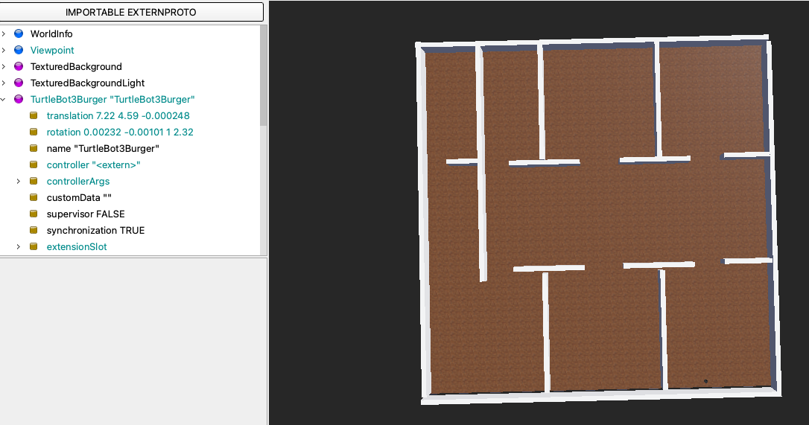
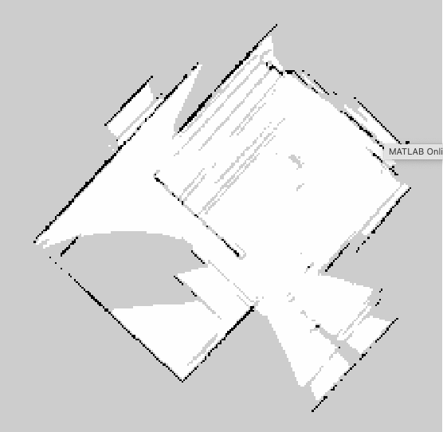
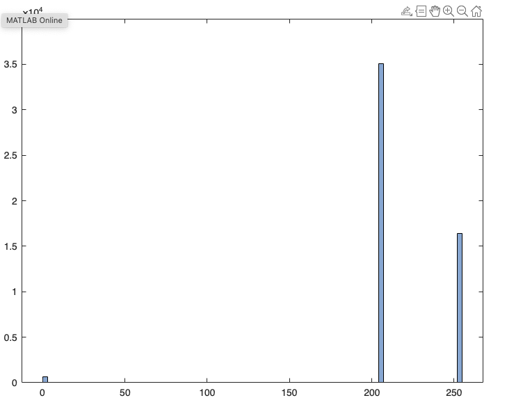
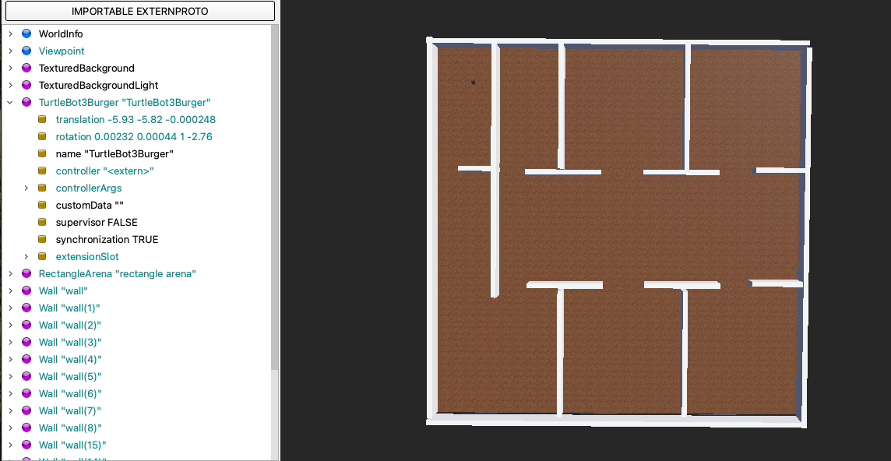
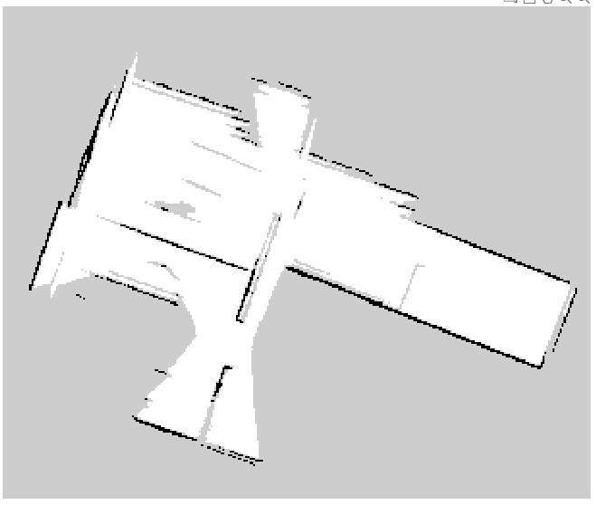
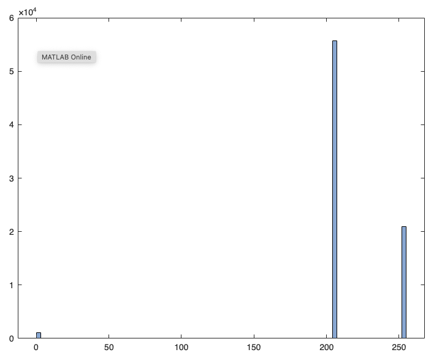
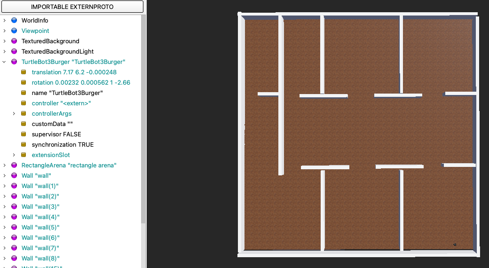
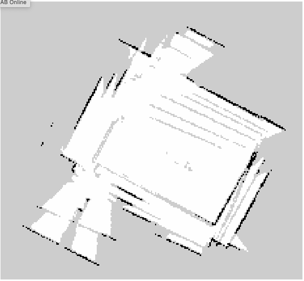
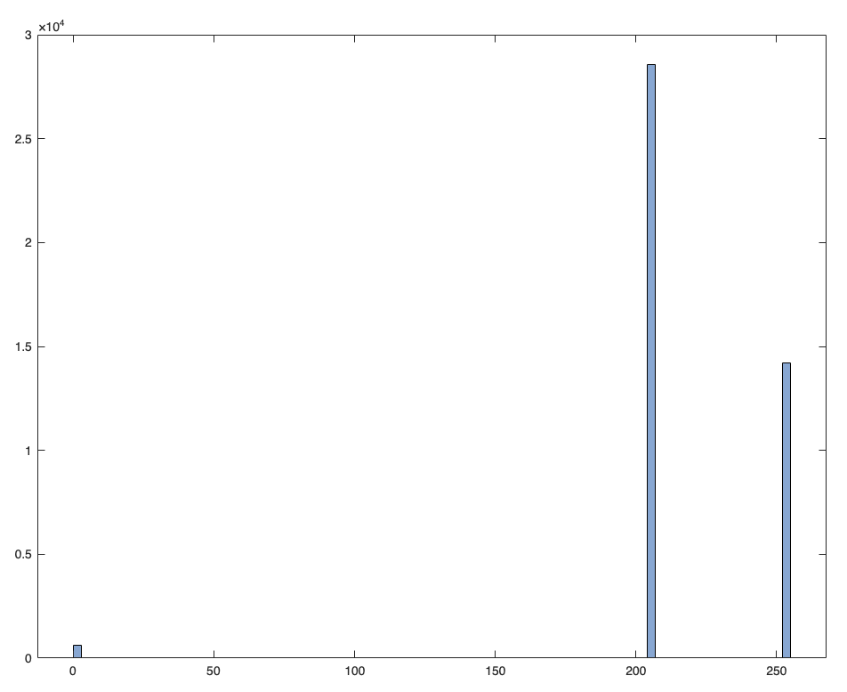

# Large Maze Test Cases

## Run 1

### Starting Position:

### Generated Map:

### Map Histogram:

### Area Covered:

41.09 m^2

## Run 2

### Starting Position:

### Generated Map:

### Map Histogram:

### Area Covered:

54.45 m^2

## Run 3

### Starting Position:

### Generated Map:

### Map Histogram:

### Area Covered:

35.54 m^2
