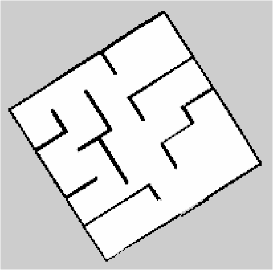

# Small Maze Test Cases

## Run 1

### Starting Position:

### Generated Map:

### Map Histogram:

### Area Covered:

42.22 m^2

## Run 2

### Starting Position:

### Generated Map:

### Map Histogram:

### Area Covered:

41.26 m^2

## Run 3

### Starting Position:

### Generated Map:

### Map Histogram:

### Area Covered:

24.035 m^2
